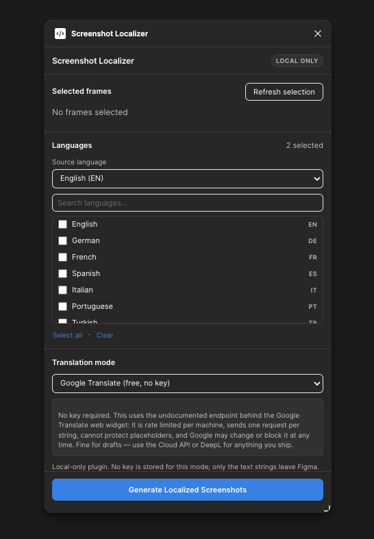
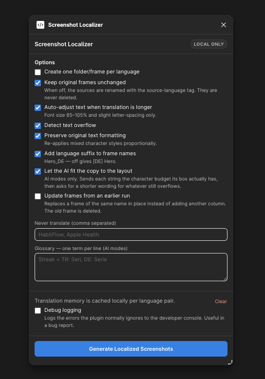

# Screenshot Localizer

[](https://github.com/tahabozdemir/figma-screenshot-localizer/actions/workflows/ci.yml)
[](LICENSE)

An open-source Figma plugin that duplicates your App Store and Google Play screenshot frames and
replaces the text with translations, one set per language — locally, with your own API key or by
hand. Translate into 31 languages via OpenAI, Gemini or Google Translate, with the copy fitted
to the layout it has to live in.

```
01_Hero_EN      →   01_Hero_DE   01_Hero_FR   01_Hero_ES …
02_Features_EN  →   02_Features_DE  …
03_Tracking_EN  →   03_Tracking_DE  …
```

Everything runs locally inside Figma. There is no backend, no account, no telemetry and no database.
The only network requests the plugin can make are to the translation provider you pick, with your own
API key — and Manual mode makes none at all.

<p align="center">
  
  
</p>

<p align="center"><em>Pick your languages and a mode, then tune how it handles your layout.</em></p>

---

## Setup

```bash
npm install
npm run build
```

Then in Figma (desktop app):

1. **Menu → Plugins → Development → Import plugin from manifest…**
2. Pick `manifest.json` in this folder.
3. Run it from **Plugins → Development → Screenshot Localizer**.

Other scripts:

| Command             | What it does                                                                   |
| ------------------- | ------------------------------------------------------------------------------ |
| `npm run build`     | Type-checks every project, then builds `dist/`                                 |
| `npm run watch`     | Rebuilds on save (re-run the plugin in Figma to pick it up)                    |
| `npm run typecheck` | Type-check only (plugin, UI and test projects)                                 |
| `npm test`          | Tests (`node --test`, no extra deps) — see [Tests](docs/architecture.md#tests) |
| `npm run clean`     | Delete `dist/` and `dist-test/`                                                |

---

## Using it

1. Select one or more frames on the canvas. Any frame works — no naming convention, no tagging, no
   special layer names. Groups, components and instances are fine too. Selecting a frame _and_
   something inside it is safe: the nested one is dropped so it is not duplicated twice.
2. The panel shows how many frames and text layers it found. **Refresh selection** re-scans.
3. Pick your source language and tick the target languages (searchable, multi-select).
4. Pick a translation mode.
5. Press **Generate Localized Screenshots**.

Generated frames land below everything already on the page, aligned with your sources: each
language stacks under the previous one, and after five languages the next one starts a new column
to the right. Re-running never lands on top of your previous output — a second run continues below
the first. (Turn on _Update frames from an earlier run_ if you would rather replace last run's
frames in place.) When it finishes, the new frames are selected and the viewport zooms to them.

Drag the bottom-right corner to resize the panel.

### Translation modes

| Mode                    | Key                     | Notes                                                                 |
| ----------------------- | ----------------------- | --------------------------------------------------------------------- |
| Manual                  | —                       | You type everything                                                   |
| OpenAI                  | `Authorization: Bearer` | Best at following instructions and keeping copy punchy                |
| Gemini                  | `x-goog-api-key`        | Same, usually cheaper                                                 |
| Google Translate        | `x-goog-api-key`        | Cloud Translation API. Fast, cheap, 64 strings per request            |
| Google Translate (free) | none                    | Unofficial endpoint — drafts only, see the caveats                    |
| DeepL                   | `DeepL-Auth-Key`        | **Doesn't work inside Figma** — [why](#why-the-deepl-modes-dont-work) |
| DeepL (Free API)        | `DeepL-Auth-Key`        | Same — DeepL's API sends no CORS headers                              |

Each mode's request shape, the batching and retry rules, the glossary and how
placeholders are protected: **[docs/providers.md](docs/providers.md)**.

### Options

| Option                                | Default | Behaviour                                                                                                                                                                   |
| ------------------------------------- | ------- | --------------------------------------------------------------------------------------------------------------------------------------------------------------------------- |
| Create one folder/frame per language  | off     | Wraps each language's frames in a Section named `[DE] German` (falls back to a plain frame if Sections are unavailable)                                                     |
| Keep original frames unchanged        | **on**  | Sources are never touched. When **off**, sources are only _renamed_ with the source-language tag — never deleted or edited                                                  |
| Auto-adjust text when longer          | **on**  | Runs the fit algorithm below                                                                                                                                                |
| Detect text overflow                  | **on**  | Produces the warning list                                                                                                                                                   |
| Preserve original text formatting     | **on**  | Re-applies mixed character styling (see limitations)                                                                                                                        |
| Add language suffix to frame names    | **on**  | `Hero_DE`. Turn off for `[DE] Hero`. Ignored once export folders are on                                                                                                     |
| Export folders per language           | off     | Names the frames `ar-SA/Hero` (App Store Connect), `ar/Hero` (Google Play) or `ar/Hero` (plain BCP-47 tag) — see [Export folders](#export-folders)                          |
| Let the AI fit the copy to the layout | **on**  | AI modes only. Sends each string its measured character budget, then asks for a shorter wording for whatever still overflows                                                |
| Update frames from an earlier run     | off     | Replaces a frame of the same name in place — same position, same parent — instead of adding to the grid below. The old frame is deleted                                     |
| Debug logging                         | off     | Logs the failures the plugin normally swallows (a locked layer, an unsupported property, storage over quota) to the developer console. Worth turning on before filing a bug |

Naming strips an existing language tag first, so `01_Hero_EN` becomes `01_Hero_DE`, not
`01_Hero_EN_DE`. Only tags that match a known language code are stripped — `Hero_V2` is left alone.

### Export folders

Figma turns a `/` in a layer name into a folder when you export more than one layer at once, so
naming the output `ar-SA/01_Hero` is all it takes to get an upload-ready archive. Pick the store in
**Options → Export folders per language**, generate, then select every generated frame, add an
export setting in the right-hand panel and press _Export_: the ZIP contains one folder per locale.

The two stores disagree on the codes, which is why it is a picker and not a switch:

| Language            | App Store Connect | Google Play | Language tag |
| ------------------- | ----------------- | ----------- | ------------ |
| Arabic              | `ar-SA`           | `ar`        | `ar`         |
| Chinese Simplified  | `zh-Hans`         | `zh-CN`     | `zh-Hans`    |
| Chinese Traditional | `zh-Hant`         | `zh-TW`     | `zh-Hant`    |
| Turkish             | `tr`              | `tr-TR`     | `tr`         |
| Norwegian           | `no`              | `no-NO`     | `nb`         |

Switching store re-folders rather than nesting: a frame that came out of an App Store run as
`ar-SA/01_Hero` becomes `ar/01_Hero` on a Play run, never `ar/ar-SA/01_Hero`. A folder of your own
survives untouched — `Screens/01_Hero` is not a locale, so nothing is stripped. With _Keep original
frames unchanged_ off, the sources are filed under the source language's own folder
(`en-US/01_Hero`), which is what makes the export complete.

The codes live on each language in `src/shared/languages.ts` (`stores`); a store locale that isn't
there yet is a one-line edit.

### Regional variants

A storefront does not get its own folder — both stores file screenshots per _localization_, and
around 175 App Store storefronts share about 40 of them. What does get its own folder is a regional
variant of a language, and six of them are separate targets in the language list:

| Target  | Name                | App Store | Play     | Translated as                         |
| ------- | ------------------- | --------- | -------- | ------------------------------------- |
| `EN-GB` | English (UK)        | `en-GB`   | `en-GB`  | DeepL `EN-GB`; AI modes get the tag   |
| `EN-AU` | English (Australia) | `en-AU`   | `en-AU`  | DeepL has no AU variant → `EN-GB`     |
| `EN-CA` | English (Canada)    | `en-CA`   | `en-CA`  | `EN-GB` — Canadian spelling is `-our` |
| `FR-CA` | French (Canada)     | `fr-CA`   | `fr-CA`  | DeepL has no CA variant → `FR`        |
| `ES-MX` | Spanish (Mexico)    | `es-MX`   | `es-419` | DeepL `ES`                            |
| `PT-BR` | Portuguese (Brazil) | `pt-BR`   | `pt-BR`  | DeepL `PT-BR`                         |

Each is a full target language, so `EN` → `EN-GB` really does go to the provider and comes back
rewritten ("color" → "colour"), with its own translation-memory bucket and its own manual-mode
column. The AI modes are the ones that honour the region, because they are handed the BCP-47 tag.

Google Translate has a single `en`, `es` and `fr`, so a variant whose engine code matches the source
would be the pair `en|en`. Rather than let the API reject it, the Google and DeepL providers copy
the text through unchanged and say so in the warning list — you still get the `en-GB/` folder, just
with the source copy in it. Use an AI mode, or Manual, if the wording has to differ.

The layout rules behind _Auto-adjust_ and _Let the AI fit the copy to the layout_ —
what gets measured, what gets shrunk and when it gives up — are in
**[docs/architecture.md](docs/architecture.md#how-the-engine-behaves)**.

---

## Known limitations

- **Component instances.** Text inside instances is edited as an override, which Figma allows. If the
  layer is bound to a component _text property_, the plugin routes the change through
  `instance.setProperties()` instead. If Figma rejects both (locked layer, restricted nested
  instance), that layer is skipped with an `error` warning rather than failing the frame.
- **Mixed character styling.** Assigning `characters` collapses per-character styles to the first
  character's style — that's the Figma API, not a choice. With _Preserve original text formatting_
  on, the original segments are re-applied over proportional ranges of the translated string, snapped
  to the nearest word boundary, and the layer gets an `info` warning. For a bold word in the middle
  of a sentence the split will usually land close but not exactly right; check those layers.
- **Fonts.** A font that isn't available in the file can't be edited, so that layer is skipped. A
  Latin-only font won't magically gain CJK or Arabic glyphs; the plugin can't inspect glyph coverage,
  so it raises one advisory note per font/script pair.
- **Duplicate strings.** Two layers with identical source text always get the same translation.
  Strings are matched by a hash of their content; before writing, the hash is verified against the
  source text it was derived from, so the one-in-a-very-large-number collision produces a skipped
  layer and an `error` warning rather than a layer silently receiving another layer's translation.
- **Hidden layers inside instances are skipped.** They are not rendered in a screenshot, so
  translating them would be pure cost — and skipping them makes the layer scan much faster.
- **Character budgets are an estimate.** Capacity is derived from the ratio of available space to the
  space the current text uses; character count does not scale linearly with box area. The model
  treats it as a hint, and the conservative fit pass is still the thing that guarantees nothing
  silently overflows.
- **Machine translation has no context.** Google Translate sees one caption at a time with no idea
  that it is a headline in a screenshot, so it will not shorten copy to fit or pick the punchier
  of two valid phrasings the way the LLM modes are told to. For hero headlines, the AI modes or
  Manual usually win; for body copy and feature lists, Google Translate is the fastest good answer.
- **Overflow detection** relies on Figma's own text measurement. Text that is clipped by an ancestor
  with `clipsContent` several levels up may still need a human eye.

### Why the DeepL modes don't work

Every network request a Figma plugin makes — from the panel iframe and from the plugin sandbox's
`fetch` alike — is a browser request with a `null` origin. CORS therefore applies everywhere, and
only APIs whose CORS headers allow that origin are reachable; Figma provides no
CORS-exempt network path. The DeepL API (Free and Pro alike) deliberately sends **no CORS headers
at all**, so the browser blocks the request before the plugin can read a byte, and both routes
fail with the browser's generic `Failed to fetch` — which is the unhelpful error that ends up in
the warning list.

The only cure would be a proxy server sitting between the plugin and DeepL to add the missing
header — and a backend is exactly what this plugin promises not to have, so there isn't one. The
DeepL modes stay in the code in case Figma ever offers a CORS-exempt `fetch` or DeepL starts
sending CORS headers; until then, use OpenAI, Gemini or Google Translate.

---

---

## Troubleshooting

**"Select at least one frame"** — select the frame itself on the canvas, not a text layer inside it.

**Changes don't show up** — after `npm run build`, close and re-run the plugin. `npm run watch`
rebuilds automatically but Figma still needs the plugin re-run.

**Everything came back untranslated** — check the warning list; an invalid key shows up as
`Language skipped: Invalid or unauthorized API key (HTTP 401)`.

**A model id stopped working** — edit the model field in the panel; it's free text and is saved.

**DeepL fails with `Failed to fetch (retry via the browser also failed: Failed to fetch)`** — not
your key and not your network. DeepL's API cannot be reached from inside a Figma plugin at all —
see [Why the DeepL modes don't work](#why-the-deepl-modes-dont-work).

**Google Translate returns 403** — the key is valid but its project doesn't have the Cloud
Translation API enabled, or billing isn't set up.

**"This Figma version cannot make requests from the plugin sandbox"** — a request fell back to the
plugin sandbox and this Figma build predates the sandbox `fetch`. Update the Figma desktop app.

---

---

## Documentation

|                                                  |                                                                                                                       |
| ------------------------------------------------ | --------------------------------------------------------------------------------------------------------------------- |
| **[docs/providers.md](docs/providers.md)**       | Every translation mode in detail, batching and retry, the glossary, placeholder protection, and how to add a provider |
| **[docs/architecture.md](docs/architecture.md)** | The four layers and why, the file tree, the ports that make it testable, and how the layout engine decides            |
| **[docs/privacy.md](docs/privacy.md)**           | Exactly what is stored and what leaves your machine                                                                   |
| **[CONTRIBUTING.md](CONTRIBUTING.md)**           | Setup, the two-runtime gotcha, and what a PR needs                                                                    |
| **[SECURITY.md](SECURITY.md)**                   | Scope, and how to report something privately                                                                          |

## Contributing

Bug reports, providers and languages are all welcome — a new provider is one file plus one
descriptor, and a new language is one object. See [CONTRIBUTING.md](CONTRIBUTING.md) for the setup
and the two or three things that are genuinely easy to get wrong.

For anything security-related — API key handling, network egress — please read
[SECURITY.md](SECURITY.md) and report it privately rather than opening an issue.

## License

[MIT](LICENSE) © Taha Bozdemir
